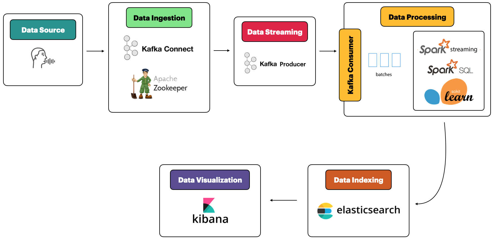

# SpeechAnalyzer

## Progetto Technologies for Advanced Programming 2019/2020
- Aldo Fiorito X81000447
- Francesco Petrosino X81000533\
Studenti presso Università di Catania cdl Informatica

## Idea e scopo
L'idea è nata osservando una community di persone all'interno dell'applicativo VOIP per le chat vocali [Discord][5]. La domanda principale posta è stata "Chi è il più chiacchierone del gruppo?". Da qui sono nate una serie di idee per ciò che sarebbe stato SpeechAnalyzer.
Lo scopo finale di quest'ultimo è quello di fornire statistiche e metriche su numerosi flussi vocali all’interno della stessa rete, in quanto l'applicativo permette di raccogliere informazioni da uno o più utenti

## Architettura e Design

## Tecnologie utilizzate
- Sintetizzatore vocale : [SpeechRecognition][4] (Google Speech Recognition)
- Zookeeper
- Kafka Connect e Kafka Streaming
- Spark Spark Streaming 
- ElasticSearch
- Kibana
## Requisiti
**N.B Il sistema operativo su cui è stato testato il progetto è Ubuntu 18.04**
- Assicurarsi di avere [Docker][3] e la versione di Python 3.6+
- Sintetizzatore vocale
    - pulseaudio 
    - python-dev
    - portaudio19-dev
    - PyAudio
## Setup
### Ip statico
Affinchè il programma funzioni in locale bisogna avere un server host. Per fare questo è necessario : 
- Clonare o scaricare il repository
- assegnare un indirizzo ip statico a una macchina
- Editare la seguente linea listeners=PLAINTEXT://**ipstatico**:9092 presente sul file SpeechAnalyzer/kafkaServer/conf/server.properties

Tutte i container sono fatti partire in host mode
### Setup Spark
- Aggiungere il file [spark-2.4.5-bin-hadoop2.7.tgz][1] sulla directory spark/setup/
### Setup Elastic
- Aggiungere il file [elasticsearch-hadoop-7.8.0.jar][2] sulla directory spark/setup/
### Rimozione volumi
- Affinchè l'applicativo parti come da ex novo bisogna rimuovere alcuni options startup dai file .sh\ nello specifico da elastic.sh e da kibana.sh\
  I tag -v , --mount e destistion=

### Guida per l'utilizzo
**N.B Tutti i comandi devono essere lanciati in terminali differenti**
- Spostarsi sulla cartella "kafkaServer"
    - ./kafkaStartZk.sh
    - ./kafkaStartServer.sh
- Spostarsi in "elasticsearch"
    - ./elastic.sh
- Andare in "spark"
    - ./startSpark.sh
- Come ultima cartella andare su "kibana"
    - ./kibana.sh

Aprire una nuova console di comando e spostarsi nella root di  "SpeechAnalyzer"\
lanciare il comando : "python3 form.py"
Inserire il proprio nome e la propria compagnia,infine selezionare la lingua desiderata e registrarsi.

[1]: https://studentiunict-my.sharepoint.com/:f:/g/personal/uni389952_studium_unict_it/EtiOBtdaJKZMj9zeuzJJ9UcB60rLKQOOjFG6yk92CBy8JQ?e=YJqarn "Repository OneDrive sp"
[2]: https://studentiunict-my.sharepoint.com/:u:/g/personal/uni389952_studium_unict_it/EeNAcubCzxxOpPPCLQOAznABSBqiCYsNhG7ZTEXAaENepg?e=jsPF6m "Repository OneDrive es"
[3]:https://docs.docker.com/get-docker/ "Docker"
[4]:https://pypi.org/project/SpeechRecognition/"SpeechRecognition"
[5]:https://discord.com/new "Discord"